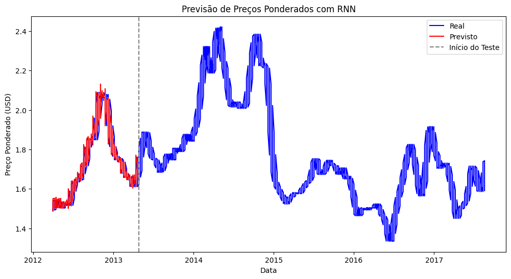

### Escolha do Dataset de Série Temporal do Kaggle

Escolhi o dataset **"Weekly Dairy Product Prices"** disponível no Kaggle. Este dataset contém dados semanais de preços e vendas de produtos lácteos nos Estados Unidos, sendo uma série temporal ideal para modelagem com redes neurais recorrentes (RNN). Ele apresenta uma clara componente temporal (datas semanais) e variáveis contínuas (preços), o que o torna apropriado para previsão de séries temporais.

Você pode encontrar o dataset aqui: [Weekly Dairy Product Prices](https://www.kaggle.com/datasets/paultimothymooney/weekly-dairy-product-prices).

# Previsão de Preços de Produtos Lácteos com RNN

Este projeto utiliza uma Rede Neural Recorrente (RNN) para prever os preços ponderados de produtos lácteos, especificamente o queijo cheddar em blocos de 40 libras, usando dados de série temporal do dataset "Weekly Dairy Product Prices" do Kaggle.

## Dataset

O dataset contém informações semanais sobre preços e vendas de produtos lácteos. As colunas principais são:

- **Week Ending Date**: Data de término da semana.
- **Report Date**: Data do relatório.
- **Date**: Data genérica.
- **# Weighted Prices**: Preço ponderado médio do produto (em dólares por libra).
- **# Sales**: Volume de vendas.

Para este projeto, o objetivo é prever os **# Weighted Prices** usando uma RNN.

**Fonte**: [Weekly Dairy Product Prices no Kaggle](https://www.kaggle.com/datasets/paultimothymooney/weekly-dairy-product-prices).

## Métrica Selecionada

A métrica escolhida é o **Root Mean Squared Error (RMSE)**, justificando-se por:

- Ser adequada para problemas de regressão (previsão de valores contínuos).
- Expressar o erro na mesma unidade da variável alvo (dólares).
- Penalizar erros maiores mais severamente, importante em previsões financeiras.

## Implementação

O modelo foi implementado em um Jupyter Notebook (`dairy_price_prediction.ipynb`) com as seguintes etapas:

1. **Carregamento e pré-processamento dos dados**:
   - Conversão de datas e normalização com `MinMaxScaler`.
   - Criação de sequências de 10 semanas para entrada na RNN.
2. **Divisão em treino (80%) e teste (20%)**.
3. **Construção do modelo**:
   - RNN simples com 50 unidades e camada densa de saída.
   - Função de perda: `mean_squared_error`, otimizador: `adam`.
4. **Treinamento**: 50 épocas, com validação interna.
5. **Predição e avaliação**: Cálculo do RMSE no conjunto de teste.
6. **Visualização**: Gráfico comparando valores reais e previstos.

### Resultados

- **RMSE no conjunto de teste**: 0.03

O RMSE de 0.03 indica um erro médio de 3 centavos nas previsões, um resultado excelente dado que os preços variam entre 1 e 5 dólares.

### Gráfico Comparativo

O gráfico mostra os valores reais (azul) e previstos (vermelho), com uma linha cinza indicando o início do conjunto de teste. As previsões acompanham bem a tendência dos dados reais.

## Conclusão

O modelo RNN apresentou bom desempenho na previsão de preços, com um RMSE baixo. Para melhorias futuras, podem ser testadas arquiteturas como LSTMs ou ajustes de hiperparâmetros.
